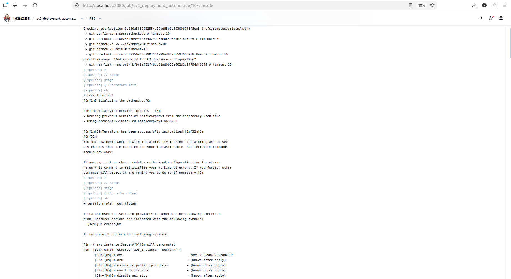
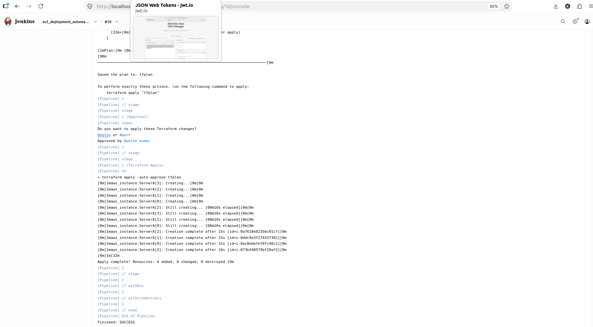
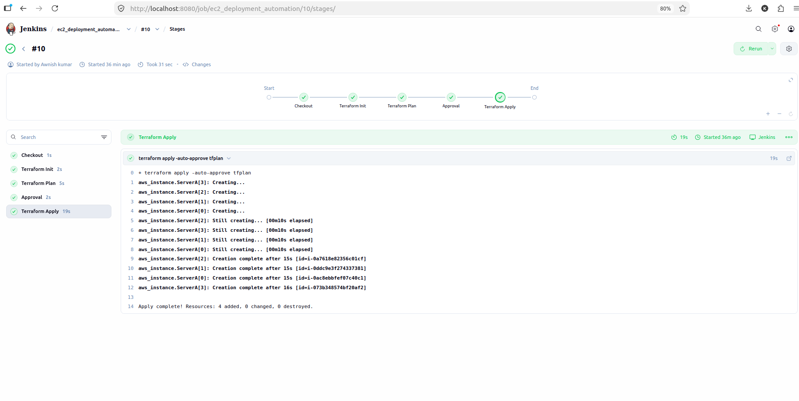
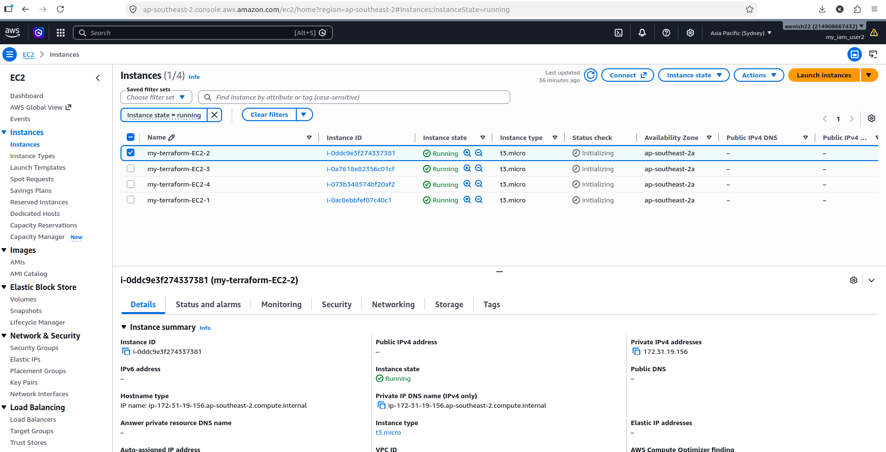

# Automated EC2 Deployment via Jenkins & Terraform

An end-to-end Infrastructure as Code (IaC) and CI/CD automation project designed to provision multi-instance AWS EC2 infrastructure using **Terraform** and **Jenkins**.

---

##  Project Overview

This project automates cloud resource deployment by establishing a declarative, pipeline-driven delivery workflow. It replaces manual console configurations with structured automation, ensuring consistent resource creation, version-controlled parameters, strict credential isolation, and manual deployment governance.

### Key Highlights
* **Declarative Infrastructure:** Manages EC2 resources through modular infrastructure code structured for scalability and consistency.
* **Flexible Parameterization:** Uses dedicated input variable definitions and value files to separate infrastructure configuration from reusable logic.
* **Automated Pipeline Execution:** Orchestrates execution across explicit build stages managed by Jenkins automation.
* **Secure Access Handling:** Leverages Jenkins credentials masking to inject cloud access keys without hardcoding secrets into source control.
* **Deployment Governance:** Integrates an interactive approval gate requiring explicit authorization before modifying cloud environments.

---

##  Architecture & Configuration Strategy

### 1. Terraform Parameterization Strategy
* **Variable Definitions:** Input parameters define configurable aspects of the environment such as target cloud regions, Amazon Machine Images (AMIs), instance sizes, and resource naming patterns.
* **Value Mapping Files (`.tfvars`):** Environment-specific values are isolated into parameter files. This allows the same base code to target different environments (Dev, Staging, Prod) by changing the supplied variable file.
* **Dynamic Resource Naming:** Resources utilize index-based naming logic to ensure every deployed compute instance receives a unique tag for tracking and management.

### 2. Jenkins Integration & Pipeline Workflow
* **Automated Checkout:** Fetches the latest committed infrastructure design directly from the Git repository.
* **Init & State Setup:** Initializes cloud provider plugins, modules, and backend configurations.
* **Execution Planning:** Generates an isolated execution plan file (`tfplan`) detailing exact infrastructure changes prior to implementation.
* **Credential Injection:** Pulls secret and access keys from the secure Jenkins Credential Store, mapping them to environment variables at runtime.
* **Human-in-the-Loop Approval:** Holds pipeline execution at a dedicated approval stage, allowing engineers to review plan outputs before triggering infrastructure modification.
* **Resource Apply:** Executes the approved execution plan to provision the target compute instances across assigned cloud networks.

---

##  Screenshots & Execution Proof

### 1. Terraform Initialization & Provider Setup
*Console execution log verifying provider plugin downloads, backend initialization, and working directory setup.*

---

### 2. Terraform Apply & Resource Provisioning
*Successful apply stage logs showing active resource instantiation and execution completion.*

---

### 3. Jenkins Full Pipeline Stage View
*Complete green status matrix across all pipeline stages, validating an error-free CI/CD execution run.*

---

### 4. Provisioned AWS EC2 Instances Verification
*AWS Management Console displaying the targeted EC2 instances in a running state with mapped subnet tags and IP assignments.*

---

##  How to Run

1. Place your configuration files and the `Jenkinsfile` in your Git repository.
2. Add all build screenshots to the `screenshots/` directory matching the paths listed above.
3. Configure your AWS credentials (`aws-access-key-id` and `aws-secret-key-id`) in your Jenkins credentials store.
4. Point your Jenkins Pipeline job to your Git repository URL and trigger the build.